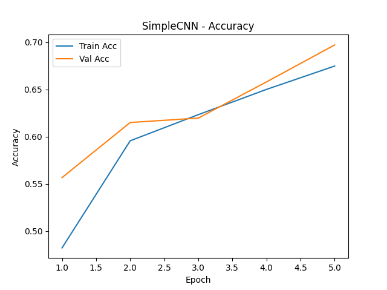
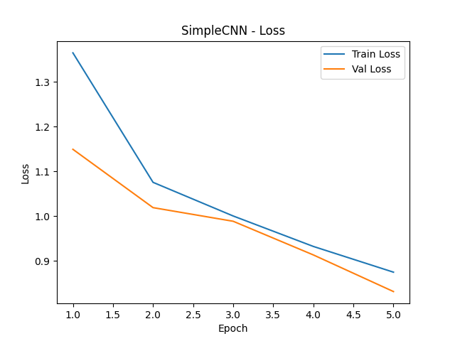
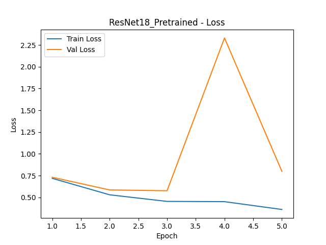
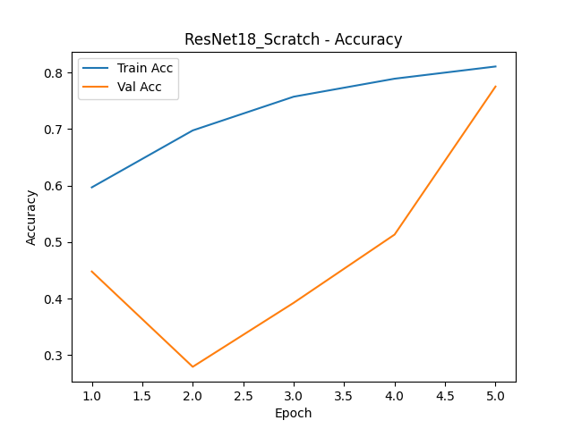
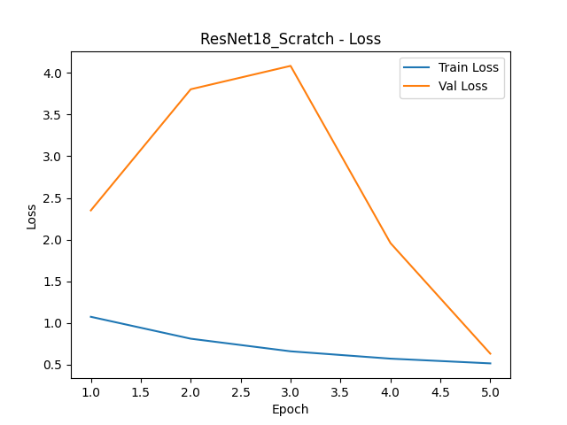
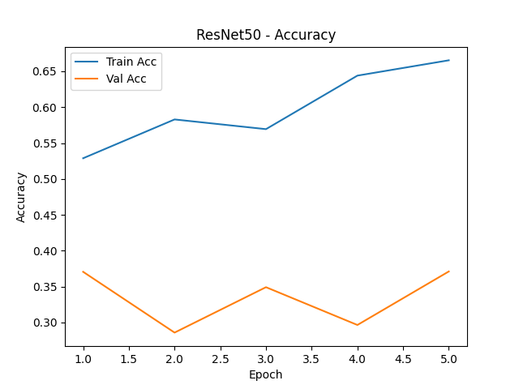
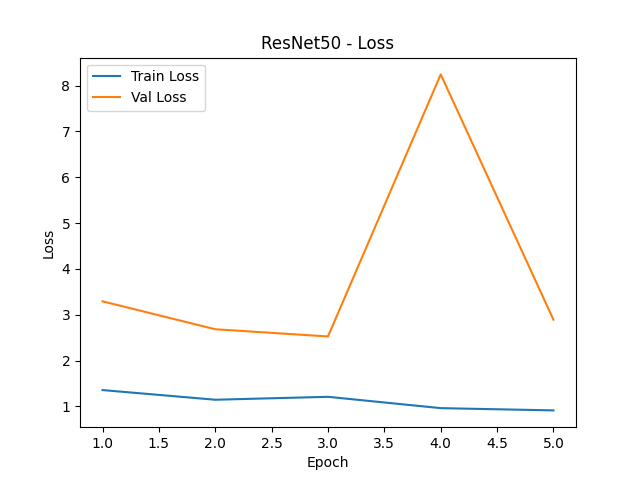

# Tissue Classification using Convolutional Neural Networks

## Overview
This project explores deep learning approaches for medical image classification using the PathMNIST dataset.

The primary goal is to compare multiple neural network architectures under identical training conditions to understand how model complexity and transfer learning affect performance.

---

## Problem Setup

- Dataset: PathMNIST (MedMNIST)
	- 9 tissue classes in greyscale
	- Training set: 89,996 images
	- Validation set: 10,004 images
	- Test set: 7,180 images
- Task: 9-class tissue classification
- Input: Histopathology images
- Training Strategy:
  - Same preprocessing
  - Same optimizer
  - Same number of epochs
  - Fair model comparison

---

## Models Evaluated

- **SimpleCNN**
  - Custom lightweight baseline model

- **ResNet18 (Scratch)**
  - Deeper architecture trained from random initialization

- **ResNet18 (Pretrained)**
  - Transfer learning from ImageNet weights

- **ResNet50**
  - Much deeper model to test effect of network depth

---

## Preprocessing

- Convert grayscale images → 3-channel
- Convert to tensors (scaled 0–1)
- No heavy augmentation (to keep comparisons fair)

---

## Training Pipeline

All models use the same pipeline:

- Loss: CrossEntropyLoss
- Optimizer: Adam
- Learning Rate: 0.001
- Epochs: 5
- Batch Size: 64

Each model follows:
1. Forward pass
2. Loss computation
3. Backpropagation
4. Parameter update

---

## Results

## Training Output:

## Simple CNN Run


## CNN Accuracy



## CNN Loss



## Plots:

## ResNet18 Pretrained Accuracy


## ResNet18 Pretrained Loss



## ResNet18 Scratch Accuracy



## ResNet18 Scratch Loss



## ResNet50 Accuracy



## ResNet50 Loss




### Final Test Performance

| Model                   | Test Accuracy | Test Loss |
|------------------------|--------------|----------|
| SimpleCNN              | 0.6722       | 0.9812   |
| ResNet18 (Scratch)     | **0.7343**   | **0.8115** |
| ResNet18 (Pretrained)  | 0.7252       | 0.8398   |
| ResNet50               | 0.5130       | 1.9158   |

---

## Observations

### Best Model: ResNet18 (Scratch)
- Highest accuracy (0.7343)
- Best loss (0.8115)
- Strong balance of depth and trainability

### Pretrained vs Scratch
- Very similar performance
- Transfer learning provided **minimal benefit**
- Likely due to domain mismatch (ImageNet vs medical data)

### ResNet50 Performance
- Performed worst (0.5130 accuracy)
- Likely undertrained (only 5 epochs)
- Too complex for limited training time

### SimpleCNN
- Lower accuracy, but solid baseline
- Shows value of deeper architectures

---

## Insights

- Some models showed overfitting (gap between train/validation)
- ResNet18 (scratch) had the most stable behavior
- Training time and model size strongly impacted results

---

## Key Takeaways

- Bigger != better (under constraints)
- Transfer learning depends on domain similarity
- Moderate-depth networks perform best in limited training setups
- Controlled experiments are critical for fair evaluation
- Much higher number of epochs would provide more in-depth training

---

## How to Run

```bash
git clone https://github.com/tjc234/cs499-project.git
cd cs499-project
pip install -r requirements.txt
python main.py
```

---

## Links

- GitHub Repo:  
  https://github.com/tjc234/cs499-project

---

## Author

Tyler Chapp  
CS499 – Computer Vision in Healthcare  
May 2026

---

## License
This project is licensed under the MIT License – see the LICENSE file for details.